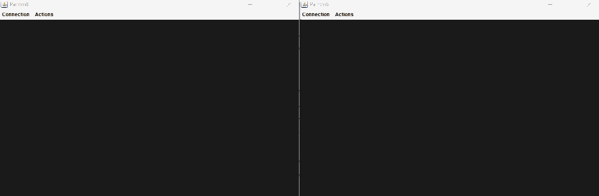

# Paintm8

Paint with your mates! A shared canvas for real-time collaborative drawing.

## Try it

Paintm8 is a fun little Java-project I did in 2009. It consists of two parts: A server and a client. Every instance of the client renders the shared canvas provided by the server.

Both parts are written in Java, so, to try it out, make sure to run an up-to-date version of the Java Development Kit (JDK).

From the paintm8/src folder:
1. Compile the server and client ```javac *.java```
2. Set up a server: ```java Paintm8Server```
3. And start however many clients you want: ```java Paintm8Client```



The client tries to connect to 127.0.0.1 (localhost) by default.

Change this from the menu: ```Connection -> Address ```

## Disclaimer

You may have realized already, but it should be made clear that Paintm8 is by no means a polished application. It is merely a first attempt at creating a fun little social gadget. What’s more, the type of collaborative drawing it aims for seems to be readily available in many of the communication tools and frameworks of today. Whatever your background, I hope you find it interesting, or at least, a bit amusing.

## Idea behind

I can remember back to my school years. Sometimes, a buddy and I would see who could outdraw the other. Using a single piece of paper, such a game could start with one of us drawing an elaborate fortresses. The other one would see this as a dare to sketch out a way of breaching the structure's solid walls. The fortress, then, had to be modified to counter the breach. And so the game would continue, back and forth, until the paper had filled up with scribbles.

Wouldn’t it be fun if this type of collaborative drawing was possible using computers over the internet? At least I thought so, back in 2009. At the time, I hadn’t come by any communication-gadget that provided that type of experience, so I set out to see if I could make it happen.

The result was my first project using Java. And a technically fun one at that, mixing networking, 2D-graphics and multi-threading.

## How it’s put together

When started, the Paintm8 Server exposes port ```3174/UDP``` and, as you’d expect from a server, awaits client connections (See ```Paintm8Server.java``` to change the port number). 
A connected client gives the user, or the painter, an always up-to-date representation of the shared canvas of the server.

Under the hood, any paint on the canvas is simply represented as 2D-vectors. When a painter starts to draw something, the various parts of the client-server system try to distribute the fresh paint as fast as possible:
1. Vectors are transmitted from the respective client to the server.
2. The server, in turn, works much like a network hub; forwarding the vectors to all the other connected clients.
3. The other clients then make sure to render the newly received vectors, giving an up-to-date representation.

Fairly basic stuff, right? Well, to make it a bit more interesting I really wanted to stress the real-time aspect of the experience. Painter A had to be able to spot when Painter B was drawing a circle, preferably long before B had completed the shape. Also, I wouldn't allow the strokes to be presented in a jittery manner. They had to be as fluid to the observer as to the one making them. To top it off, all this had to hold true even when the painters were painting simultaneously.
A daunting task, I thought initially. But, in the end, it didn't require all that much novelty. I will mention some of the things I found interesting and the lessons learned:

### UDP, not TCP
My initial version had the server and clients communicate through TCP. Arguably the easier and better protocol for most cases, but with its inherent buffering and overhead, the latency got too high. The paint didn’t show up quickly enough. I had to change to UDP. With it, I got my low latency, but at a cost. The bare-bone datagram protocol could not guarantee that the packets arrived, or, if they did, that they got there in the correct order. Not a big issue, I decided, given the carefree nature of the project.  

### Draw only what is new
The client’s rendering of the canvas is very fast. Not because it’s clever, but because it’s super simple: When the mentioned vectors are sent its way, they are drawn as lines on top of the previous bitmap representation of the canvas. Nothing more. That means only a small part of the canvas needs to be rendered, saving time.

### Time sharing
The various procedures that make up the client-server program are handled by different threads.

The client, for example, can be split in three:
- ```A``` The interactive thread, registering the mouse movement and clicks. ```Paintm8Client.java```
- ```B``` The transmission thread, responsible for sending the “paint strokes” to the server. ```ClientTransmission.java```
- ```C``` And the reception thread, listening for other painter's strokes and applying them to the canvas. ```ClientReception.java```

From time to time, all of these threads need to read or write to common resources, like the list of vectors. And, as anyone who has dealt with threads knows, care must be taken to synchronization them. Noone wants race conditions or iconsistent data. A consequence of the synchronization, though, is that one thread might have to wait for the other to finish. Especially if that other thread spends too much time.
To ensure a smooth user experience, it was important to scrutinize the work done during these lock-downs. I experienced that even small changes would yield big improvements.

### Double buffering

I suppose double buffering is often a good fit when dealing with parallel processes. I certainly made use of it to great effect. With this simple and elegant technique, I could practically decouple two of the threads working on the same data, namely the transmission thread (```B```) and the interactive thread (```A```). Using two buffers instead of only one, ```B``` could continue to transmit the backlog of paint strokes without blocking ```A``` from accumulating fresh paint. The actual buffer switch was the only thing that needed to run inside the lock. The result was a much smoother user experience.

## Todos
There's a lot that could be done better here. However, my immediate plan is to leave the program as it is; Functioning, and with a code sprinkled with what could have been examples of how not to do it. I don't whish to stop anyone from contributing, though. Have at it!

Happy painting!
