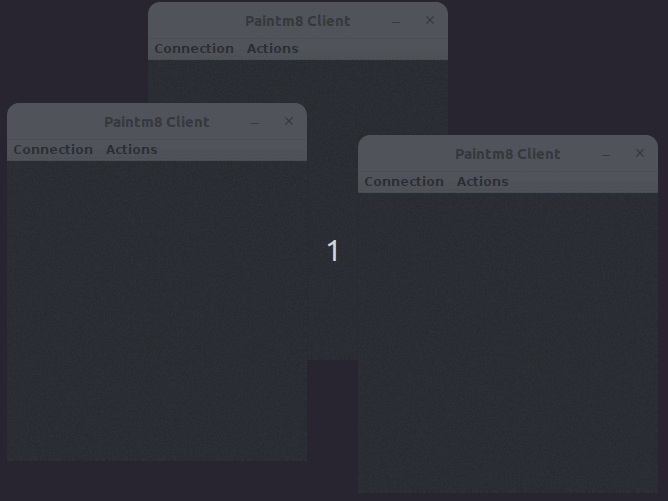

# Paintm8

Paint with your mates! A shared canvas for real-time collaborative drawing.

## Try it

Paintm8 is the result of a fun little educational challenge I gave myself back 
in 2009.
The code has since been cleaned up to make sure it builds and runs with modern 
JDKs.

Paintm8 runs as 1 server and N number of clients - Paintm8Server and 
Paintm8Client, respectively.
Every instance of Paintm8Client renders a shared canvas managed by a single 
Paintm8Server.

Use Maven to build and start the server and however may clients:

##### Build
```mvn compile```

##### Start the Paintm8 server

```mvn exec:java@server```

##### Start a couple of Paintm8 clients:
```mvn exec:java@client``` 

```mvn exec:java@client```



When started, the Paintm8Client will look for the server on IP 127.0.0.1 
(localhost).
The address, however, can be changed from the client's menu: 
```Connection -> Address```

## How it came about

Nothing beats a white-board session for discussing and drawing out ideas, right? - 
be they realistic or fantastical.

Key to making it a successful session, though, is that each participant is free 
to grab the marker at will and illustrate his or her points.
 
"How difficult would it be to create a digital whiteboard?", I caught myself 
wondering. It was the perfect challenge to tackle for deliving into the world of 
Java, requiring networking, 2D-graphics and multi-threading.

## How it’s put together

When started, the Paintm8 Server exposes port ```3174/UDP```, awaiting fresh 
paint from the various clients. This in the form of 2D-vectors in datagram 
packets. 
The Paintm8Client gives the user, i.e. the painter, an up-to-date representation
 of the shared canvas.

When a painter starts to draw, the various parts of the client-server system 
distribute the fresh paint as fast as possible:
1. Vectors are transmitted from the respective client to the server.
2. The server, in turn, much like a network hub, forwards the vectors to all 
the other clients.
3. The clients then render the received vectors on its own canvas.

To make it a bit interesting I really wanted to stress the real-time aspect of 
the experience. 
Painter A had to be able to spot when Painter B was drawing a circle - 
preferably long before B had completed the shape. Also, I wouldn't settle for 
storkes presented in a jittery manner. They had to be as fluid to the observer 
as to the one making them. 
To top it off, all this had to hold true even when the painters were painting 
simultaneously. A daunting task, I thought initially, but little by little it 
came together. 

Here are some of the things I found interesting and the lessons learned:

### UDP, not TCP
My initial version had the server and clients communicate through TCP. Arguably 
the easier and better protocol for most cases, but with its inherent buffering 
and overhead, the latency got too high. The paint just didn’t show up quickly 
enough. I had to change to UDP. With it, I got my low latency, but at a cost. 
The bare-bone datagram protocol could not guarantee that the packets arrived, 
or, if they did, that they got there in the correct order. Not a big issue, I 
decided, given the carefree nature of the project.  

### Draw only what is new
The client’s rendering of the canvas is quite fast. Not because it’s clever, 
but because it’s super simple: 

When the strokes of paint reach a client, they are drawn as lines on top of the
previous bitmap representation of the canvas. 
Nothing more. That means only a small part of the canvas needs to be rendered, 
saving time.

### Time sharing
The various procedures that make up the client-server program are handled by 
different threads.

The client, for example, can be split in three:
- ```A``` The interactive thread, registering the mouse movement and clicks. 
```Paintm8Client.java```
- ```B``` The transmission thread, responsible for sending the “paint strokes” 
to the server. ```ClientSend.java```
- ```C``` And the reception thread, listening for other painter's strokes and 
applying them to the canvas. ```ClientReceive.java```

From time to time, all of these threads need to read or write to common 
resources, like the list of vectors. And, as anyone who has dealt with threads 
knows, care must be taken to synchronize them. Noone wants race conditions or 
iconsistent data. 
A consequence of the synchronization, though, is that one thread might have to 
wait for the other to finish. Especially if that other thread spends too much 
time. To ensure a smooth user experience, it was important to scrutinize the 
work done during these lock-downs. I experienced that even small changes would 
yield big improvements.

### Double buffering

One of my a-ha moments during development was when I realized that I could 
introduce double buffering to minimize the lock-downs. Of course I shouldn't 
have been surprised that parallel processes and double buffering would be a good
fit, but it was nice to see the effect of such a simple and elegant technique. 
With it, I could practically decouple two of the threads working on the same 
data, namely the transmission thread (```B```) and the interactive thread 
(```A```). 
Using two buffers instead of only one, ```B``` could continue to transmit the 
backlog of paint strokes without blocking ```A``` from accumulating fresh paint. 
The actual buffer switch was the only thing that needed to run inside the lock. 
The result was a much smoother user experience.

## Contribution
Fixes, refactoring and features are welcome. Have at it!

And happy painting!